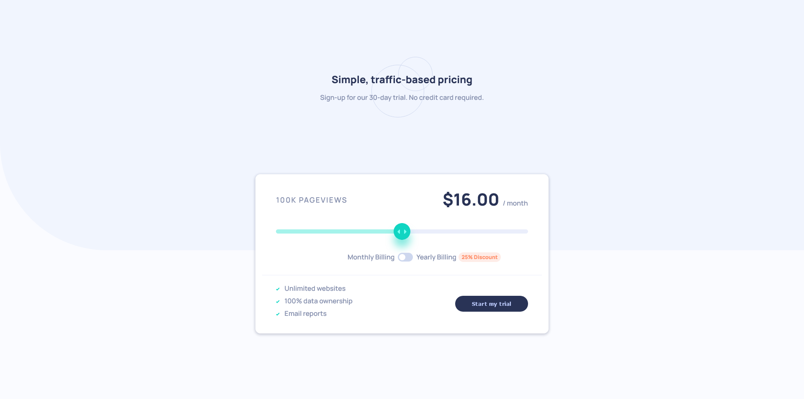

# Frontend Mentor - Interactive pricing component solution

This is a solution to the [Interactive pricing component challenge on Frontend Mentor](https://www.frontendmentor.io/challenges/interactive-pricing-component-t0m8PIyY8). Frontend Mentor challenges help you improve your coding skills by building realistic projects.

## Table of contents

- [Overview](#overview)
  - [The challenge](#the-challenge)
  - [Screenshot](#screenshot)
  - [Links](#links)
- [My process](#my-process)
  - [Built with](#built-with)
  - [What I learned](#what-i-learned)
  - [Continued development](#continued-development)
  - [Useful resources](#useful-resources)
- [Author](#author)

## Overview

### The challenge

Users should be able to:

- View the optimal layout for the app depending on their device's screen size
- See hover states for all interactive elements on the page
- Use the slider and toggle to see prices for different page view numbers

### Screenshot



### Links

- Solution URL: [GitHub](https://github.com/spaziutempu/faq-accordion-card)
- Live Site URL: [https://endearing-kashata-e54a35.netlify.app/](https://endearing-kashata-e54a35.netlify.app/)

## My process

### Built with

- Semantic HTML5 markup
- css combinators
- Flexbox
- Mobile-first workflow
- JS

### What I learned

- how to create a slider on CSS

```css
#checkbox:checked ~ .toggle_round {
  transform: translateX(15px);
}
```

- how to style range input on chrome / mozilla

```css
.pricing_range::-webkit-slider-runnable-track {
  -webkit-appearance: none;
}

.pricing_range::-moz-range-progress {
  ...;
}
```

```JS
  e.target.style.backgroundSize = `
    ${((Currentvalue - minValue) * 100) / (maxValue - minValue)}%`;
```

### Continued development

### Useful resources

- [Styling range input with CSS](https://nikitahl.com/style-range-input-css) - This helped me to style input range on mozilla
- [Redouaneajgagal source code](https://redouaneajgagal.github.io/interactive-pricing-component/) - This helped me a lot to understand how to style input range for chrome

=

## Author

- Website - [Github](https://github.com/spaziutempu)
- Frontend Mentor - [@spaziutempu](https://www.frontendmentor.io/profile/spaziutempu)
